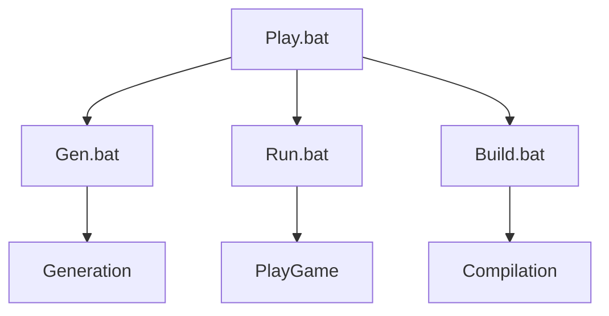

# GENERAND

> a minecraft random mod generator

`Minecraft version: 1.18.3`

## how to use :

to generate a mod and lauch the game, run :
`Play.bat`

to only generate the random mod files, run :
`Gen.bat`

to play **without** generating a new mod, run :
`Run.bat`

to generate the mod as .jar file, run :
`Build.bat`
(.jar will be in the Build\ folder)

**Directories** 
* `Build` Contains the mod as a .jar 
* `MDK` Contains the tools to build the mod and test it
* `Python` Contains the mod generator

**Inside the Python directory**
* `Generator` Contains all the logic
* `src` Folder where the uncompiled mod files will be generated 
