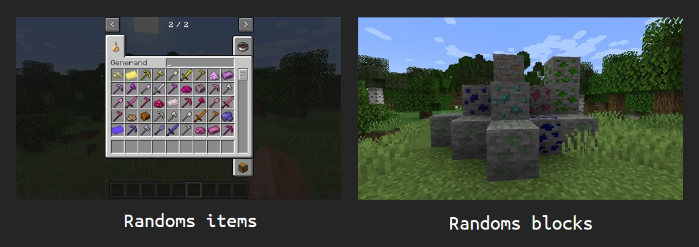

# GENERAND

> a minecraft random mod generator

`Minecraft version: 1.18.3`




## how to use :

to generate a mod and lauch the game, run :
`Play.bat`

to only generate the random mod files, run :
`Gen.bat`

to play **without** generating a new mod, run :
`Run.bat`

to generate the mod as .jar file, run :
`Build.bat`
(.jar will be in the Build\ folder)


**Directories** 
* `Build` Contains the mod as a .jar 
* `MDK` Contains the tools to build the mod and test it
* `Python` Contains the mod generator

**Inside the Python directory**
* `Generator` Contains all the logic
* `src` Folder where the uncompiled mod files will be generated 


## How ?
> okay so how is everything working ?

Creating a minecraft mod require a lot of files

This tools works by creating theses files automatic and random

all the code for the generator is containd here :

`Python\Generator\libs`

the starting point of the generator is the `main()` function insinde 
`Python\Generator\libs\Main.py`

a lot of classes included in the project dosent work like default python class/objects but rather by overiding behaviors to simplify the syntax

its therefore recomended not to think about objects and classes but by files and others kind of abstract objects

for example, creating a empty file we can write 

```python
DF("resources/example")

#here DF is a class, but we dont need to reference the object since juste like a singleton, if we write the same line again, it will reference the exact same file, unchanged

DF("resources/example") # same file as before
```

*resources/example being its path*

thene we can fill this empty file with data

```python
DF("resources/example") | "res/ex"

# here the "res/ex" represent the path of a "template" file located inside the Generator/Templates directory
```


___

# Detailed functionalities

Its said earlier that the program was creating and editing files, its partialy true

since opening and closing files can takes some unessessary ressources, there is a class called `MF` (minecraft file)

its simply an abstract representation of a file purely in python, that has a path, and some text content

it also has a method to *build* it into a real file

`MF` is core of the program, and the first step to understand its workflow


i will now explains the other features extending from `MF` based on some problematics we will encounter

since we will have to create a lot of file that have mostly the same content between eachothers, `MF` should have `actions` to edit the file with ease

the most usefull action would be to fill the file with boilerplate text, for that we use "template" files, located inside the `Generator/Templates` directory

the content of a template file will be copied into our `MF`


the simple syntax for that is by using the `|` operator :

```python
MF("ressources/item/pickaxe") | "item/pickaxe"
# will copy the content of the template file item/pickaxe into the MF
```

there ere multiple other operators that can achieve differents goals such as replacing a special **patern**

## Paterns

what is a **patern** ?

its a bite of text that can be replaced with some specific data

`¤` is the symbole to encapsulate a **paterns**

`¤id¤`

Paterns are parsed using regex *(`re` python library)*

Paterns are **Replaced** but if you want to keep the patern after writing you can do it like this:
`¤>id¤`

```
Hello ¤Name¤
v
Hello Paul


Hello ¤>Name¤
v
Hello Paul¤>Name¤
```


## Limitation of MF

the problem here is the order in wich the differents actions among all files are done


the solution here is to create a layer above `MF`:

`DF` (Dependency  Files)


## Dependency Files

